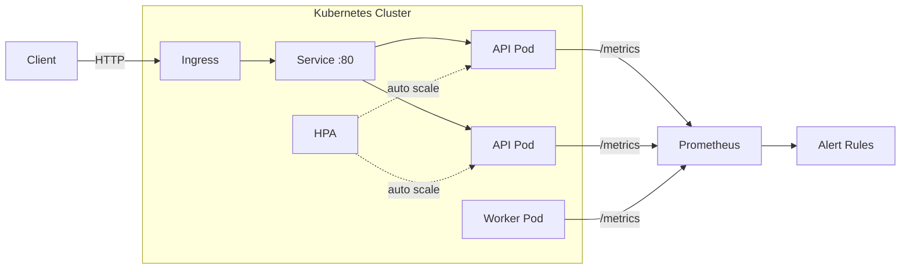
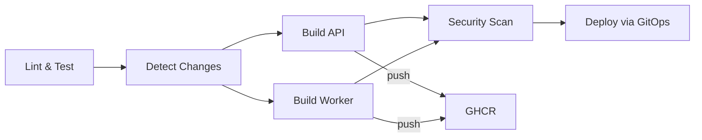
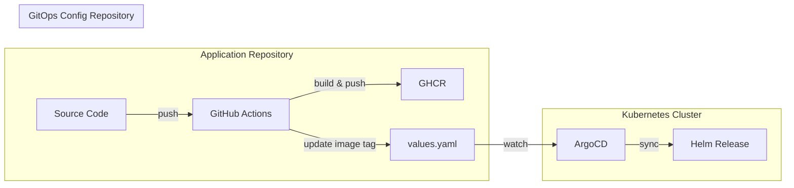
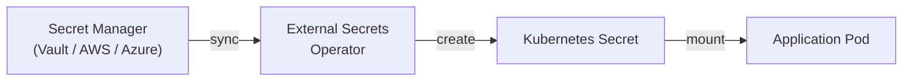

# Basic CI/CD with Kubernetes

A containerized application consisting of an API service and a background worker, deployed on Kubernetes via Helm and automated through GitHub Actions CI/CD pipeline.

## Table of Contents

- [Architecture Overview](#architecture-overview)
- [Project Structure](#project-structure)
- [Setup Instructions](#setup-instructions)
- [Usage Instructions](#usage-instructions)
- [Services](#services)
- [Docker](#docker)
- [Kubernetes (Helm)](#kubernetes-helm)
- [CI/CD Pipeline](#cicd-pipeline)
- [Monitoring and Observability](#monitoring-and-observability)
- [Failure Scenarios](#failure-scenarios)
- [Production Recommendations](#production-recommendations)

---

## Architecture Overview



### CI/CD Flow



## Project Structure

```
.
├── .github/workflows/
│   └── ci-cd.yml              # GitHub Actions CI/CD pipeline
├── helm/
│   ├── Chart.yaml
│   ├── values.yaml            # Default values (development)
│   ├── values-uat.yaml        # UAT overrides
│   ├── values-prod.yaml       # Production overrides
│   └── templates/
│       ├── _helpers.tpl
│       ├── api-deployment.yaml
│       ├── api-service.yaml
│       ├── api-hpa.yaml
│       ├── api-pdb.yaml
│       ├── worker-deployment.yaml
│       ├── configmap.yaml
│       ├── secret.yaml
│       ├── serviceaccount.yaml
│       ├── ingress.yaml
│       ├── networkpolicy.yaml
│       ├── servicemonitor.yaml
│       └── prometheusrule.yaml
├── services/
│   ├── api/
│   │   ├── Dockerfile
│   │   ├── package.json
│   │   ├── tsconfig.json
│   │   ├── jest.config.js
│   │   └── src/
│   │       ├── app.ts         # Express app (routes, middleware)
│   │       ├── app.test.ts    # Unit tests
│   │       └── index.ts       # Server entrypoint
│   └── worker/
│       ├── Dockerfile
│       ├── package.json
│       ├── tsconfig.json
│       ├── jest.config.js
│       └── src/
│           ├── index.ts
│           └── worker.test.ts # Unit tests
├── env/
│   ├── dev.env.example
│   ├── uat.env.example
│   └── prod.env.example
├── docker-compose.yml
├── tsconfig.base.json
├── package.json
├── Makefile
└── README.md
```

## Setup Instructions

- Node.js 20+
- Docker Desktop with Kubernetes enabled
- Helm 3
- kubectl

```bash
# Clone the repository
git clone https://github.com/Heenzaa1998/basic-cicd-k8s.git
cd basic-cicd-k8s

# Install dependencies
npm install
```

## Usage Instructions

### Makefile

All common commands are available via `make`:

```bash
make help            # Show all available targets
make install         # Install dependencies
make lint            # Run ESLint
make typecheck       # TypeScript type checking
make build           # Build all services
make test            # Run unit tests
make docker-up       # Start with Docker Compose
make helm-lint       # Lint Helm chart
make helm-install    # Install Helm release
make clean           # Remove build artifacts
```

### Local Development

```bash
# Run API in dev mode
npm run dev:api

# Run Worker in dev mode
npm run dev:worker
```

### Docker Compose

```bash
# Development
docker compose up --build

# UAT
ENV_FILE=uat docker compose up --build

# Production
ENV_FILE=prod docker compose up --build
```

### Kubernetes (Helm)

```bash
# Deploy with default values (pulls from GHCR)
helm install myapp helm/

# Deploy with production values
helm install myapp helm/ -f helm/values-prod.yaml

# Upgrade existing release
helm upgrade myapp helm/

# Uninstall
helm uninstall myapp
```

---

## Services

### API Service

An Express.js application exposing REST endpoints with Prometheus metrics integration.

| Endpoint   | Description                        |
|------------|------------------------------------|
| `/health`  | Health check with uptime and version |
| `/metrics` | Prometheus metrics (OpenMetrics)   |

**Health check response:**

```json
{
  "status": "ok",
  "timestamp": "2026-03-18T00:41:48.994Z",
  "uptime": 43,
  "version": "1.0.0",
  "environment": "development"
}
```

### Background Worker

A long-running process that executes a periodic task (timestamp logging) every 5 seconds. Includes a health server on port 9090 for Kubernetes probes and Prometheus metrics.

| Endpoint   | Port | Description                            |
|------------|------|----------------------------------------|
| `/health`  | 9090 | Worker health with stall detection     |
| `/metrics` | 9090 | Prometheus metrics (tick count, timing) |

The worker health endpoint returns HTTP 503 if no tick has occurred within 3 intervals (15 seconds), enabling Kubernetes to automatically restart stalled workers.

---

## Docker

Both services use multi-stage builds to minimize image size and attack surface.

| Property          | API                  | Worker               |
|-------------------|----------------------|----------------------|
| Base image        | `node:20-alpine`     | `node:20-alpine`     |
| Build stage       | TypeScript compile   | TypeScript compile   |
| Production stage  | `dist/` + prod deps  | `dist/` + prod deps  |
| Runs as           | Non-root `node` user | Non-root `node` user |
| Exposed port      | 3000                 | 9090                 |

---

## Kubernetes (Helm)

### Resources

| Resource                  | Description                                          |
|---------------------------|------------------------------------------------------|
| Deployment (API)          | 2+ replicas with pod anti-affinity                   |
| Deployment (Worker)       | 1 replica for background processing                  |
| Service                   | ClusterIP exposing API on port 80                    |
| HorizontalPodAutoscaler   | Scales API pods based on CPU utilization             |
| PodDisruptionBudget       | Ensures minimum 1 API pod during maintenance         |
| ConfigMap                 | Environment variables (NODE_ENV, LOG_LEVEL, etc.)    |
| Secret (optional)         | Sensitive data, disabled by default                  |
| ServiceAccount            | Dedicated service account (not default)              |
| Ingress (optional)        | External traffic routing with TLS support            |
| NetworkPolicy (optional)  | Restricts pod-to-pod traffic to port 3000            |
| ServiceMonitor            | Prometheus auto-discovery for metrics scraping       |
| PrometheusRule            | Alert rules for error rate, latency, and worker health|

### Environment-Specific Values

| Parameter            | Dev       | UAT       | Production   |
|----------------------|-----------|-----------|--------------|
| API replicas         | 2         | 2         | 3            |
| HPA max replicas     | 5         | 5         | 10           |
| HPA target CPU       | 70%       | 70%       | 60%          |
| API CPU request      | 100m      | 200m      | 500m         |
| API memory request   | 128Mi     | 256Mi     | 512Mi        |
| Ingress              | Disabled  | Disabled  | Enabled+TLS  |
| NetworkPolicy        | Disabled  | Enabled   | Enabled      |
| Monitoring           | Disabled  | Disabled  | Enabled      |

### Probes

| Probe     | API                          | Worker                        |
|-----------|------------------------------|-------------------------------|
| Readiness | `GET /health` port 3000      | `GET /health` port 9090       |
| Liveness  | `GET /health` port 3000      | `GET /health` port 9090       |

---

## CI/CD Pipeline

The GitHub Actions pipeline runs on every push to `main` and on pull requests.

### Stage Details

**1. Lint and Test**
- Install dependencies with `npm ci`
- ESLint static analysis
- TypeScript type checking (`tsc --noEmit`)
- Build verification
- Test execution

**2. Detect Changes**
- Uses `dorny/paths-filter` to identify which services changed
- Shared files (`tsconfig.base.json`, `package-lock.json`, `.dockerignore`, `.github/workflows/**`) trigger both builds

**3. Build Container Images**
- Conditional builds per service (API and Worker independently)
- Pushes to GitHub Container Registry (`ghcr.io`)
- Tags: commit SHA + `latest`
- Pull requests build but do not push

**4. Security Scan**
- Trivy vulnerability scanner on each built image
- Table output in CI logs for immediate visibility
- SARIF upload to GitHub Security tab for tracking
- Scans only CRITICAL and HIGH severity

**5. Deploy (GitOps - Mocked)**
- Validates Helm chart with `helm lint`
- Renders manifests with `helm template` (dry-run)
- Simulates GitOps workflow: clone config repo, update image tags, commit, push for ArgoCD sync

### Change Detection Matrix

| Changed File               | API Build | Worker Build |
|----------------------------|-----------|--------------|
| `services/api/**`          | Yes       | No           |
| `services/worker/**`       | No        | Yes          |
| `tsconfig.base.json`       | Yes       | Yes          |
| `package-lock.json`        | Yes       | Yes          |
| `.dockerignore`            | Yes       | Yes          |
| `.github/workflows/**`     | Yes       | Yes          |
| `helm/**`                  | No        | No           |
| `README.md`                | No        | No           |

---

## Monitoring and Observability

### Structured Logging

All services emit structured JSON logs to stdout, compatible with log aggregation systems (Loki, Fluentd, CloudWatch).

```json
{
  "timestamp": "2026-03-18T00:41:48.994Z",
  "level": "info",
  "service": "api-service",
  "message": "request completed",
  "method": "GET",
  "path": "/health",
  "statusCode": 200
}
```

### Prometheus Metrics

**API Metrics (port 3000, path `/metrics`)**

| Metric                          | Type      | Description                         |
|---------------------------------|-----------|-------------------------------------|
| `http_request_duration_seconds` | Histogram | Request latency distribution        |
| `http_requests_total`           | Counter   | Total requests by method/route/code |
| `http_request_errors_total`     | Counter   | Total 4xx and 5xx responses         |
| Default Node.js metrics         | Various   | CPU, memory, event loop, GC         |

**Worker Metrics (port 9090, path `/metrics`)**

| Metric                          | Type    | Description                         |
|---------------------------------|---------|-------------------------------------|
| `worker_last_tick_timestamp`    | Gauge   | Unix timestamp of last successful tick |
| `worker_ticks_total`            | Counter | Total ticks processed               |
| Default Node.js metrics         | Various | CPU, memory, event loop, GC         |

### ServiceMonitor

When enabled (production), Prometheus auto-discovers and scrapes metrics from both services at a configurable interval (default: 15s).

### Alert Rules (PrometheusRule)

| Alert             | Condition                                     | Severity | Duration |
|-------------------|-----------------------------------------------|----------|----------|
| HighErrorRate     | 5xx errors > 5% of total requests             | Critical | 5m       |
| HighLatency       | p95 latency > 1 second                        | Warning  | 5m       |
| WorkerStalled     | No worker tick for > 30 seconds               | Critical | 1m       |
| PodCrashLooping   | Container restart rate > 0 over 15 minutes    | Critical | 5m       |

---

## Failure Scenarios

### Pod Failure

| Scenario                    | Kubernetes Response                                          |
|-----------------------------|--------------------------------------------------------------|
| API pod crashes             | Deployment controller restarts the pod. HPA maintains minimum replicas. PDB ensures at least 1 pod remains available during voluntary disruptions. |
| Worker pod crashes          | Deployment controller restarts the pod. Liveness probe detects stalled workers (no tick for 15s) and triggers automatic restart. |
| Liveness probe fails        | kubelet kills the container and restarts it according to the pod's restart policy (Always). |
| Readiness probe fails       | Pod is removed from Service endpoints. Traffic is routed only to healthy pods. No restart is triggered. |

### Node Failure

| Scenario                    | Kubernetes Response                                          |
|-----------------------------|--------------------------------------------------------------|
| Single node goes down       | Pod anti-affinity ensures API pods are spread across nodes. Scheduler places replacement pods on healthy nodes. |
| Node drain (maintenance)    | PDB prevents evicting all API pods simultaneously. At least 1 pod remains available throughout the drain process. |

### Resource Exhaustion

| Scenario                    | Kubernetes Response                                          |
|-----------------------------|--------------------------------------------------------------|
| CPU limit reached           | Container is throttled but not killed. HPA scales up additional pods when average CPU exceeds target (60-70%). |
| Memory limit exceeded       | Container is OOM-killed and restarted by the kubelet to prevent impact on other workloads. |
| HPA max replicas reached    | No further scaling occurs. Alert rules notify operators of sustained high load for manual intervention. |

### Deployment Failures

| Scenario                    | Kubernetes Response                                          |
|-----------------------------|--------------------------------------------------------------|
| Bad image tag               | Pod enters `ImagePullBackOff`. Deployment rollout stalls. Previous healthy revision continues serving traffic. |
| Application crash on start  | Pod enters `CrashLoopBackOff` with exponential backoff. Previous healthy pods continue serving if available. |
| Failed health checks        | New pods never become Ready. Rollout does not proceed, preserving the previous stable version. |

### Recovery Procedures

| Scenario             | Resolution                                                    |
|----------------------|---------------------------------------------------------------|
| Rollback deployment  | `helm rollback myapp <revision>` restores previous configuration |
| Force restart pods   | `kubectl rollout restart deployment/<name>` triggers rolling restart |
| Scale manually       | `kubectl scale deployment/<name> --replicas=<n>` overrides HPA temporarily |
| Debug failing pod    | `kubectl logs <pod>` and `kubectl describe pod <pod>` for diagnostics |

---

## Production Recommendations

This project implements a mocked deploy step for demonstration purposes. Below is the recommended production-grade GitOps workflow for real deployments.

### GitOps Workflow (ArgoCD)

In production, the CI pipeline does not deploy directly to the cluster. Instead, it updates image tags in a separate **GitOps config repository**, and ArgoCD handles the actual deployment.



**Flow:**

1. Developer pushes code to the application repository
2. GitHub Actions builds, tests, and pushes the image to GHCR
3. CI updates the image tag in the GitOps config repository via commit
4. ArgoCD detects the config change and syncs the new manifests to the cluster
5. Kubernetes performs a rolling update with zero downtime

### Separation of Concerns

| Repository              | Purpose                                 |
|-------------------------|-----------------------------------------|
| Application repo        | Source code, Dockerfiles, CI pipeline   |
| GitOps config repo      | Helm values per environment, ArgoCD Application manifests |
| Infrastructure repo     | Base Helm charts, shared templates      |

### App-of-Apps Pattern

For multi-service or multi-environment deployments, ArgoCD's app-of-apps pattern manages all applications from a single root:

```
gitops-config/
  apps/
    root-app.yaml              # ArgoCD root Application
    basic-cicd-k8s/
      dev/
        values.yaml            # Dev environment overrides
      uat/
        values.yaml            # UAT environment overrides
      prod/
        values.yaml            # Production environment overrides
```

Each environment is an ArgoCD `Application` pointing to the same Helm chart with different values files. Promotion between environments is done by updating the image tag in each environment's `values.yaml`.

### Secret Management

In production, secrets should never be stored in Git. The recommended approach is to use a centralized secret manager combined with the External Secrets Operator to sync secrets into Kubernetes automatically.

#### Supported Secret Providers

| Provider                      | Use Case                          | Integration                          |
|-------------------------------|-----------------------------------|--------------------------------------|
| HashiCorp Vault               | Self-hosted, multi-cloud          | ClusterSecretStore + Vault Agent     |
| AWS Secrets Manager           | AWS-native workloads (EKS)        | ClusterSecretStore + IRSA            |
| AWS Systems Manager (SSM)     | AWS parameter store               | ClusterSecretStore + IRSA            |
| Azure Key Vault               | Azure-native workloads (AKS)      | ClusterSecretStore + Workload Identity |
| GCP Secret Manager            | GCP-native workloads (GKE)        | ClusterSecretStore + Workload Identity |

#### Flow



1. Secrets are stored and managed in the secret manager (versioned, audited, access-controlled)
2. External Secrets Operator periodically polls the secret manager for changes
3. ESO creates or updates Kubernetes `Secret` resources automatically
4. Application pods consume secrets via environment variables or volume mounts

#### Example: ExternalSecret Resource

```yaml
apiVersion: external-secrets.io/v1beta1
kind: ExternalSecret
metadata:
  name: app-secrets
spec:
  refreshInterval: 1h
  secretStoreRef:
    name: vault-backend          # or aws-secrets-manager
    kind: ClusterSecretStore
  target:
    name: app-secrets
    creationPolicy: Owner
  data:
    - secretKey: DATABASE_URL
      remoteRef:
        key: projects/basic-cicd-k8s/prod
        property: DATABASE_URL
    - secretKey: API_KEY
      remoteRef:
        key: projects/basic-cicd-k8s/prod
        property: API_KEY
```

#### Additional Components

| Component           | Tool                         | Description                              |
|---------------------|------------------------------|------------------------------------------|
| Image pull secrets  | ExternalSecret               | Auto-rotates registry credentials        |
| TLS certificates    | cert-manager                 | Auto-provisions and renews TLS via Let's Encrypt or private CA |
| Secret rotation     | External Secrets Operator    | Automatic refresh on configurable interval (default: 1h) |


### Production Checklist

| Category       | Requirement                                                |
|----------------|------------------------------------------------------------|
| Registry       | Use private registry with image signing (Cosign)           |
| Networking     | Enable NetworkPolicy, use Ingress with TLS termination     |
| Monitoring     | Deploy Prometheus stack, configure ServiceMonitor and alert rules |
| Logging        | Deploy log aggregation (Loki/Fluentd/CloudWatch)           |
| Security       | Enable PodSecurityStandards (restricted), run as non-root  |
| Backup         | Configure PV snapshots and database backup CronJobs        |
| GitOps         | ArgoCD with app-of-apps, automated sync with manual promotion |
| CI/CD          | Branch protection, required reviews, signed commits        |
| Scaling        | HPA with custom metrics, Cluster Autoscaler for nodes      |
| Resilience     | PDB, pod anti-affinity, multi-AZ node pools                |

